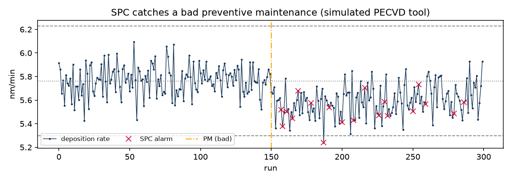
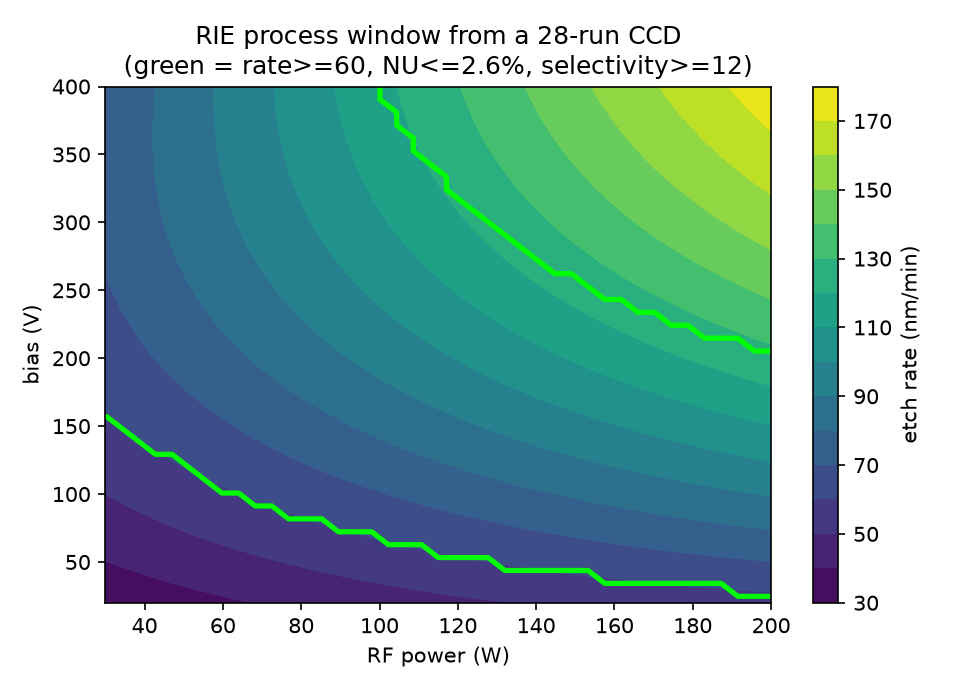
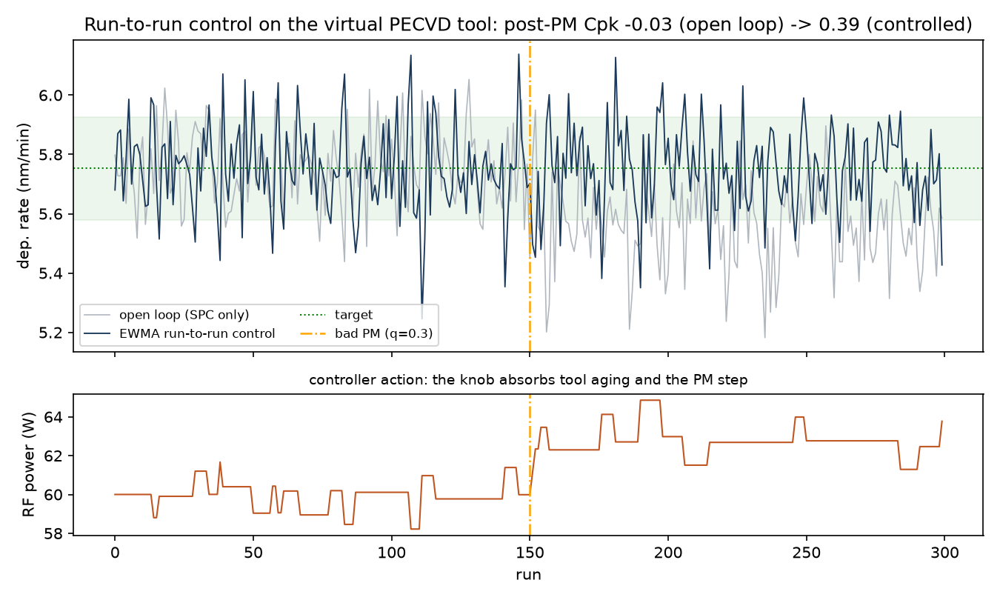

# plasmafab — a virtual plasma fab

Physics-light **PECVD, RIE and magnetron-sputter tool models** wrapped in the
daily toolkit of a plasma process & equipment engineer: **Design of
Experiments**, **SPC monitoring**, **run-to-run (APC) control**, **process
capability**, a **root-cause walkthrough**, and a **cluster-tool demo**
(PECVD + sputter on one vacuum system) — with a Streamlit dashboard on top.

> **All data in this project is simulated.** The tool models follow textbook
> plasma-processing behaviour and are documented in
> [`plasmafab/models.py`](plasmafab/models.py), but they are invented, not
> calibrated to any real equipment. I built this to practise, in code, the
> methods used around real plasma tools: my hands-on background is thesis
> work fabricating and characterizing a-Si:H single-photon avalanche diodes
> (RIE mesa etch on PECVD-deposited stacks) — see
> [nanodevo.github.io](https://nanodevo.github.io).



## What's inside

| Piece | What it does |
|---|---|
| `plasmafab/models.py` | PECVD deposition, SF6 RIE etch and reactive-sputtered TCO (AZO-like) models: rate, uniformity, selectivity, resistivity, transmittance, defect proxy as functions of RF power, pressure, gas flows, O2 fraction, bias, temperature; slow tool-state drift (RF match, wall seasoning, MFC offset) |
| `plasmafab/doe.py` | 2^k full factorial and face-centred CCD designs, coded units, OLS effects tables, quadratic response surfaces, multi-response **process-window maps** |
| `plasmafab/spc.py` | I-MR, X-bar/R and EWMA control charts, frozen-baseline limits, **Western Electric rules**, Cp/Cpk |
| `plasmafab/apc.py` | **EWMA run-to-run controller** (Ingolfsson–Sachs form) with deadband and qualified-window clamping; controller gain taken from the DOE response surface |
| `plasmafab/simulate.py` | Production histories with injectable faults (an imperfect PM, an MFC calibration step) and a full TCO / p-i-n / TCO **stack builder** in cluster-tool or air-break mode |
| `plasmafab/fmea.py` | **PFMEA** scaffolding (S/O/D, RPN) with *measured* detection: inject a failure mode, count runs-to-alarm, score D from the experiment |
| `app.py` | Streamlit dashboard: live SPC with event injection, DOE window explorer, capability tab |
| `notebooks/root_cause_bad_pm.py` | Excursion investigation, chart → signature → physics → corrective procedure |
| `notebooks/eight_d_report.py` | The same incident written up as a formal **8D report** (D1–D8): containment, root cause, verified fix, recurrence prevention |
| `notebooks/dmaic_capability_study.py` | **Six Sigma DMAIC** case study: a stable-but-not-capable film spec taken from Cpk 0.65 to >3 via CCD response surfaces and a process-window move, closed with a control plan |
| `notebooks/pfmea_pecvd.py` | Worked **process FMEA** for the PECVD step: detection ratings backed by injected-failure experiments, top risks actioned and re-scored |
| `notebooks/tool_matching_qual.py` | **Tool qualification & chamber matching**: OQ/PQ-style release with TOST equivalence testing - holds a mis-calibrated chamber, releases it after the fix into fleet SPC |



## Quick start

```bash
pip install -e .
python examples/run_doe.py                    # DOE screening + CCD in the terminal
python examples/run_apc.py                    # run-to-run control, open vs closed loop
python notebooks/root_cause_bad_pm.py         # root-cause walkthrough (or run cells in VS Code)
python notebooks/eight_d_report.py            # the incident as a formal 8D report
python notebooks/dmaic_capability_study.py    # Six Sigma DMAIC capability project
python notebooks/pfmea_pecvd.py               # PFMEA with measured detection ratings
python notebooks/tool_matching_qual.py        # chamber matching + qualification release
streamlit run app.py                          # dashboard
```

## The three demos

**1. DOE process windows.** A 28-run face-centred CCD on the virtual RIE tool
fits quadratic response surfaces (R² ≥ 0.94) for etch rate, non-uniformity and
selectivity, then intersects spec limits into a process window. The window is
genuinely bounded: rate pushes toward high power/bias, selectivity pushes back.

**2. SPC tool monitoring.** A qualified recipe runs for 300 lots while the tool
ages. Inject a bad PM (chamber not re-seasoned) and watch the I-chart's Western
Electric rules and the EWMA chart flag it within a handful of runs — with
limits frozen on the qualified baseline, the way a fab actually runs SPC.

**3. Root cause.** The walkthrough pins the excursion in time (rule hits at
run ~157 after a PM at 150), reads the multivariate signature (rate down a few
percent, defects up double-digit), reasons to the subsystem (wall seasoning,
not MFC or RF match), verifies against the simulation's hidden tool state, and
ends in a corrective procedure: a post-PM qualification gate.

**4. Run-to-run control (APC).** SPC only *detects*; production fabs also
*compensate*. `examples/run_apc.py` closes the loop with an EWMA run-to-run
controller: the DOE response-surface slope becomes the controller gain, and RF
power is trimmed each run to hold deposition rate on target through tool aging
and the bad PM. Post-PM Cpk recovers from −0.03 (open loop) to the
noise-limited value — and the demo states the honest limit: R2R restores
centering, it cannot reduce the tool's inherent run-to-run noise.



**5. Why cluster tools exist.** `examples/run_stack.py` deposits the full
TCO / a-Si:H p-i-n / TCO stack both ways: on one vacuum system (the one-unit
PECVD + sputter configuration my thesis samples were produced on) and on
standalone tools with an air break between TCO and silicon. The air break
costs ~5x in interface defects and ~25% in contact resistivity — the concrete
argument for integrated deposition platforms.

## Honest scope

This is a learning-in-public project, built in preparation for plasma process
engineering roles. The statistics (DOE, SPC, capability) are implemented from
the standard definitions and verified against known constants; the plasma
models are qualitative. I have not run DOE or SPC in a production fab — this
repo is how I closed that gap before someone pays me to do it on real tools.

## License

MIT
